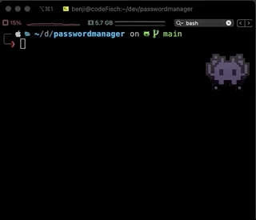
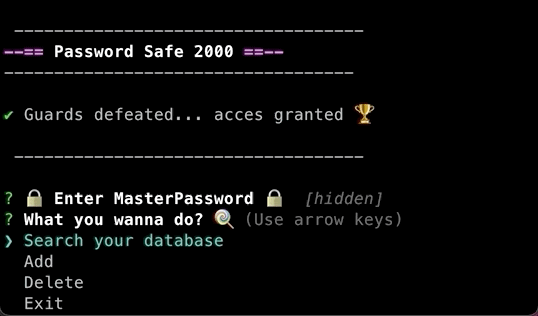
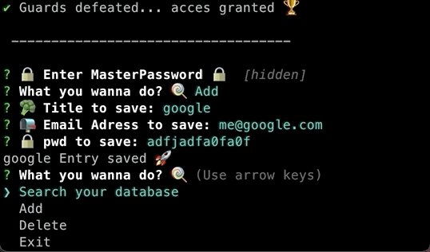
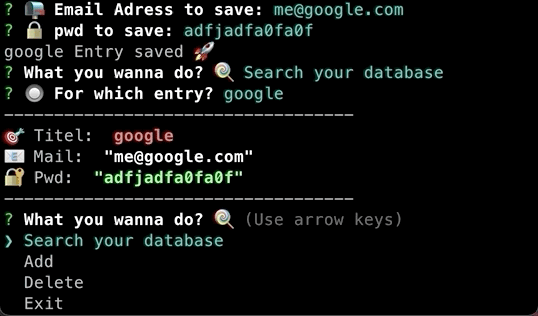

# --== Password Safe 2000 ==--

## Features

- using `node.js` + `inquierer` for running and displaying input/outpu
- storing everyting encrypted (`CryptoJS`) in `MongoDB`
- you are able to use `Docker` for running your local instance of `mongoDB` with persistent data

## Usage

### 🗃 .env (required)

- put a `.env`-File in the aplication root with following content:

```
DB_URL=mongodb://localhost:27017/PwData
CRYPTO_PWD=yourCryptoPW
MASTER_PWD=yourLoginPassword
```

where

- `DB_URL` points to your local or cloud-based mongoDB
- `CRYPTO_PW` is used to encrypt Data
- `MASTER_PW` ist used to login to the app

### 🐳 with local mongoDB Docker-Container

- with docker installed just run and make use of the `DB_URL` above:

```Shell
    $ docker-compose up
```

## Start

- run `node app.js` in the project-root in your favourite Terminal

### Demo

::: Login :::


::: Add :::


::: Search :::


::: Delete :::

